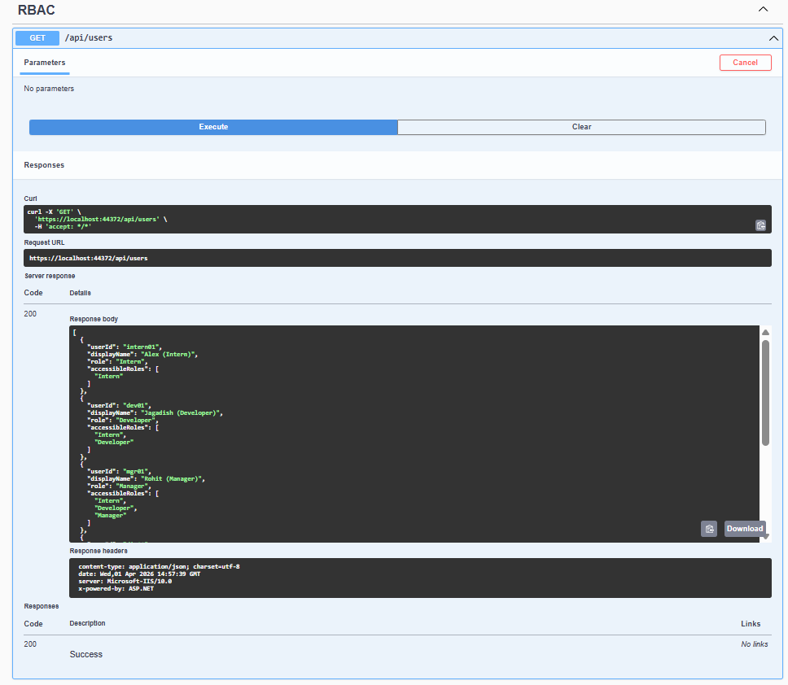
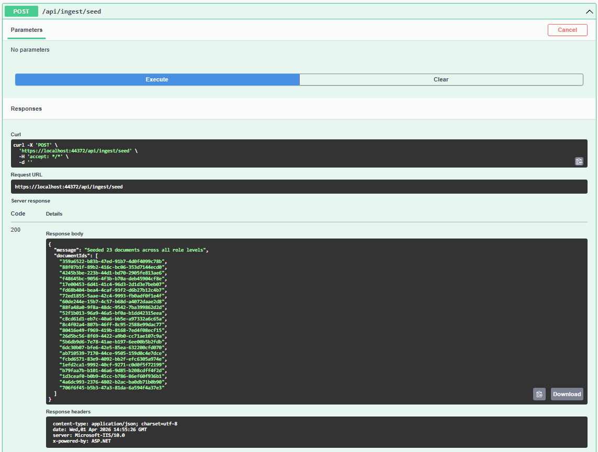
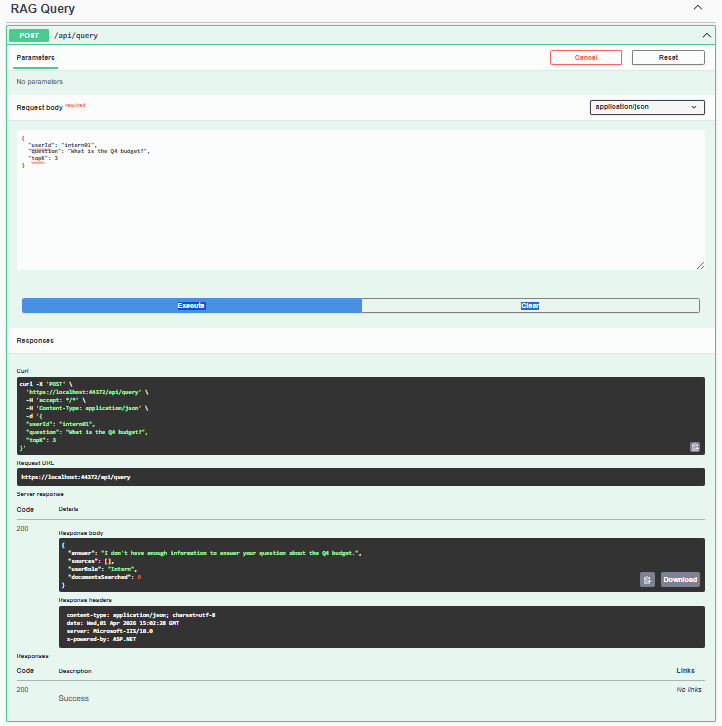
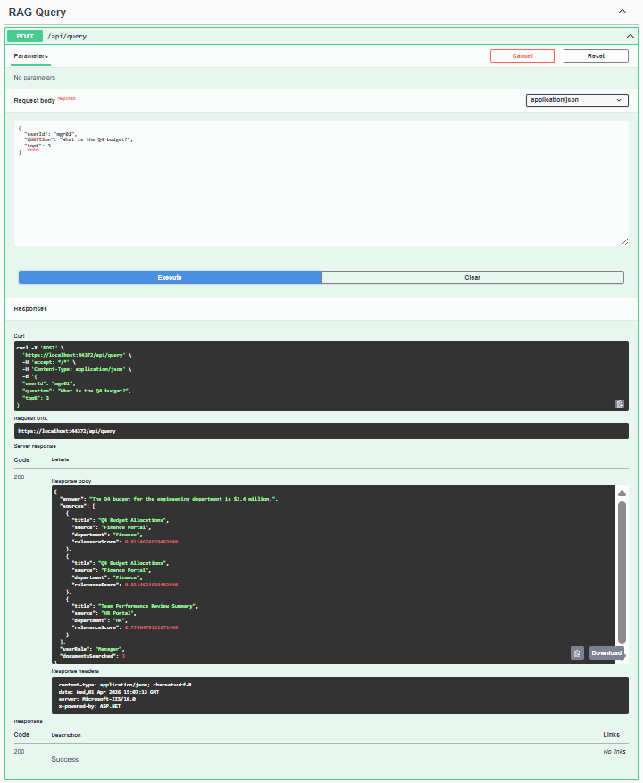

# RAG + RBAC

> Role-Based Access Control enforced at the vector search layer — sensitive documents never reach the LLM.

A .NET 8 Minimal API that combines Retrieval-Augmented Generation with document-level access control. Documents are filtered via Pinecone metadata **before** retrieval, ensuring users only see content matching their clearance level.

## Tech Stack

| Layer | Technology |
|-------|-----------|
| Runtime | .NET 8 (ASP.NET Minimal APIs) |
| Orchestration | Microsoft Semantic Kernel 1.30 |
| LLM | Azure OpenAI GPT-4o |
| Embeddings | text-embedding-ada-002 (1536d) |
| Vector Store | Pinecone (metadata filtering) |
| API Docs | Swagger / Swashbuckle |

## How It Works

```
                        ┌──────────────┐
  User Query ──────────>│  RBAC Layer  │  Resolve user role & accessible levels
                        └──────┬───────┘
                               v
                        ┌──────────────┐
                        │  Embedding   │  Convert query to 1536-dim vector
                        │  (ada-002)   │
                        └──────┬───────┘
                               v
                        ┌──────────────┐
                        │  Pinecone    │  Vector search WITH metadata filter:
                        │  + RBAC      │  MinimumAccessRole IN [allowed roles]
                        └──────┬───────┘  Unauthorized docs are NEVER retrieved
                               v
                        ┌──────────────┐
                        │  GPT-4o      │  Generate answer from filtered context
                        └──────────────┘
```

**Security model:** RBAC is enforced at the vector search layer, not post-retrieval. Documents a user cannot access are excluded from the search results entirely — they never enter the LLM context window.

## Role Hierarchy

| Role | Level | Access Scope |
|------|-------|-------------|
| Intern | 0 | Intern docs only |
| Developer | 1 | Intern + Developer |
| Manager | 2 | Intern + Developer + Manager |
| Director | 3 | All except Admin |
| Admin | 4 | Everything |

## RBAC in Action

### 1. List Users & Access Levels

`GET /api/users` — returns all users with their role and accessible role levels.



### 2. Seed Sample Documents

`POST /api/ingest/seed` — ingests sample documents tagged across all role levels into Pinecone.



### 3. Query as Intern (Restricted)

An **Intern** asks _"What is the Q4 budget?"_ — the budget document requires Manager-level access, so RBAC blocks it. The LLM responds with _"I don't have enough information"_ because the document was never retrieved.



### 4. Query as Manager (Authorized)

A **Manager** asks the same question — now the budget document is within their access scope. The LLM returns the answer with source citations.



## Quick Start

### Prerequisites

- .NET 8 SDK
- Azure OpenAI resource (`gpt-4o` + `text-embedding-ada-002` deployments)
- Pinecone index (`rbac-rag-docs`, 1536 dimensions, cosine metric)

### Configure

Update `appsettings.json`:

```json
{
  "AzureOpenAI": {
    "Endpoint": "https://YOUR-RESOURCE.openai.azure.com/",
    "ApiKey": "YOUR-KEY",
    "ChatDeployment": "gpt-4o",
    "EmbeddingDeployment": "text-embedding-ada-002"
  },
  "Pinecone": {
    "ApiKey": "YOUR-PINECONE-KEY",
    "IndexName": "rbac-rag-docs"
  }
}
```

> Use `dotnet user-secrets` or environment variables for real credentials. Never commit actual keys.

### Run

```bash
dotnet restore
dotnet run
```

### Test

```bash
# Seed sample documents
curl -X POST http://localhost:5000/api/ingest/seed

# Query as Developer
curl -X POST http://localhost:5000/api/query \
  -H "Content-Type: application/json" \
  -d '{"userId": "dev01", "question": "What is our cloud infrastructure?", "topK": 3}'

# RBAC comparison — same question, all roles
curl http://localhost:5000/api/demo/rbac-comparison?question=What%20is%20the%20Q4%20budget
```

## API Reference

| Method | Endpoint | Description |
|--------|----------|-------------|
| `GET` | `/api/users` | List all users with access levels |
| `POST` | `/api/ingest` | Ingest a document with role tag |
| `POST` | `/api/ingest/seed` | Seed sample documents |
| `POST` | `/api/query` | RAG query with RBAC enforcement |
| `GET` | `/api/demo/rbac-comparison` | Compare responses across all roles |

## Project Structure

```
RAG_RBAC/
├── Models/
│   ├── AppUser.cs            # AppRole enum (5 levels) + AppUser
│   ├── RagDocument.cs        # Pinecone vector record with role metadata
│   └── Dtos.cs               # Request/Response records
├── Services/
│   ├── RbacService.cs        # User store + role hierarchy logic
│   ├── IngestionService.cs   # Embed + upsert to Pinecone
│   ├── RagQueryService.cs    # RBAC-filtered RAG pipeline
│   └── SeedData.cs           # Sample docs across all role levels
├── Program.cs                # DI, Semantic Kernel config, endpoints
└── appsettings.json          # Configuration (placeholder keys)
```
